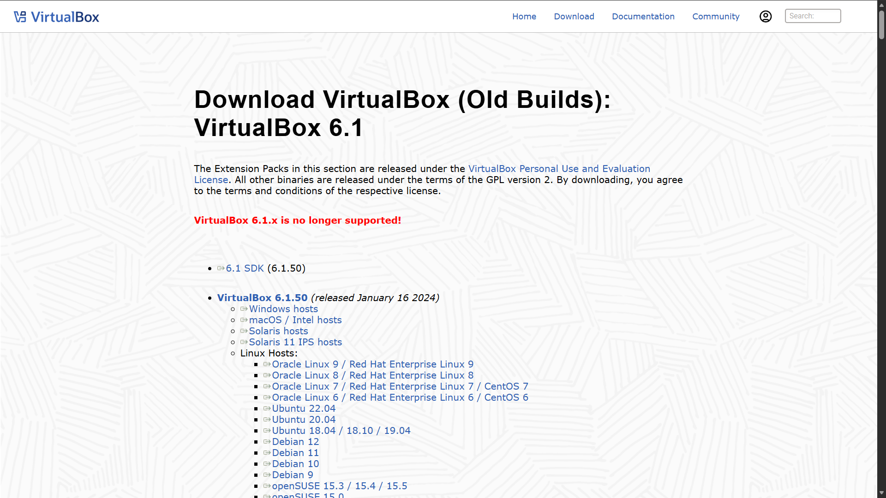
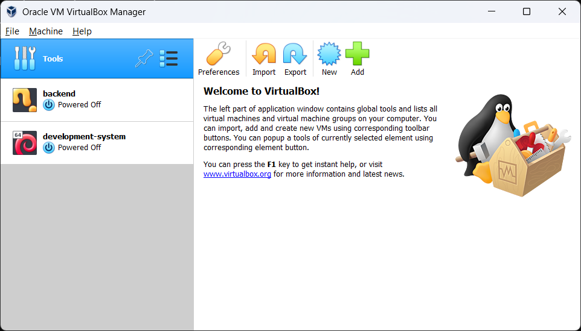
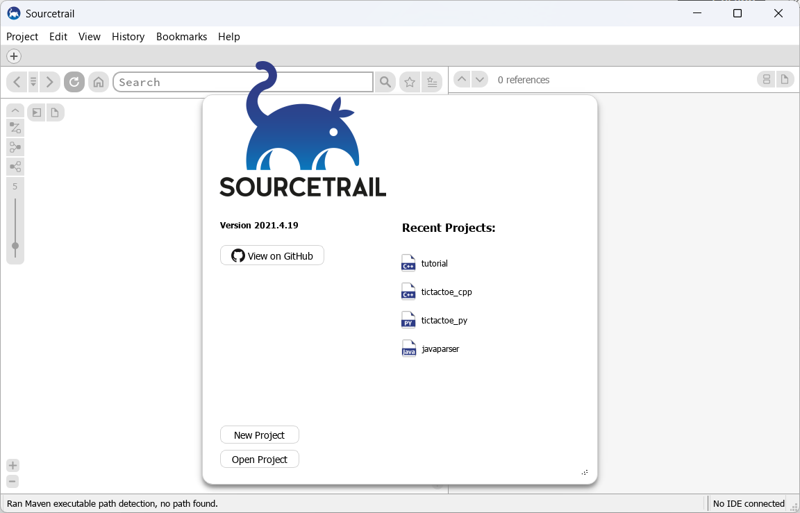

<h1 align="center">Laporan Praktikum Modul 1  Running Modul</h1>

NIZAR DAFFA MAULANA - 2311104019

## Dasar Teori

Virtualisasi adalah teknologi yang memungkinkan kita membuat simulasi dari hardware fisik. Dengan virtualisasi, kita bisa menjalankan beberapa OS secara bersamaan di atas satu mesin fisik (Host).

Oracle VM VirtualBox merupakan software Hypervisor yang digunakan untuk mengeksekusi Virtual Machine. Keuntungannya adalah memungkinkan kita bereksperimen dengan OS tanpa risiko merusak sistem utama di komputer kita.

## Guided

### Installasi Oracle VM VirtualBox

Saya menggunakan VirtualBox versi 6.1 untuk praktikum kali ini.

Selanjutnya install VirtualBox sampai selesai.

### Installasi Sourcetrail

Selanjutnya install Sourcetrail, download di [Github Sourcetrail](https://github.com/CoatiSoftware/Sourcetrail/releases)

## Referensi

1. https://en.wikipedia.org/wiki/Virtual_machine
