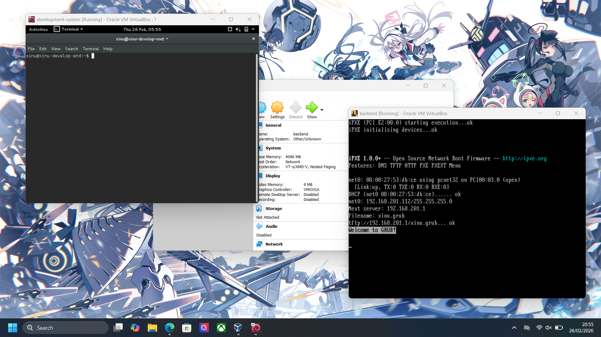

<h1 align="center">Laporan Praktikum Modul 2  Installasi Xinu</h1>

NIZAR DAFFA MAULANA - 2311104019

## Dasar Teori

Xinu (akronim dari Xinu Is Not Unix) adalah OS kecil berorientasi pendidikan yang dikembangkan oleh Douglas Comer. Karakteristik Xinu, dirancang agar mudah dipahami strukturnya, sehingga sangat cocok untuk mempelajari internal sistem operasi, manajemen proses, dan memori. Format file yang digunakan seringkali berbentuk .ova (Open Virtualization Format Archive) yang siap diimpor ke dalam VirtualBox.

## Guided

## Referensi

1. https://en.wikipedia.org/wiki/Xinu
