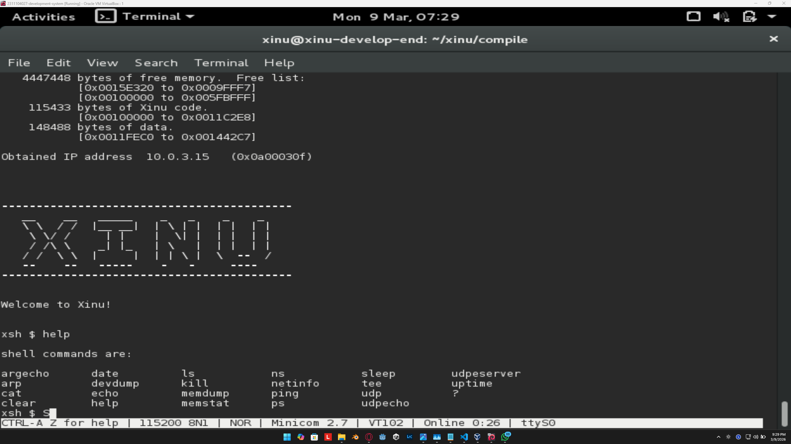

<h1 align="center">Laporan Praktikum Modul 3  Eksplorasi Xinu</h1>

NIZAR DAFFA MAULANA - 2311104019

## Dasar Teori

Xinu (akronim dari Xinu Is Not Unix) adalah OS kecil berorientasi pendidikan yang dikembangkan oleh Douglas Comer. Karakteristik Xinu, dirancang agar mudah dipahami strukturnya, sehingga sangat cocok untuk mempelajari internal sistem operasi, manajemen proses, dan memori. Format file yang digunakan seringkali berbentuk .ova (Open Virtualization Format Archive) yang siap diimpor ke dalam VirtualBox.

## Guided

### 1. Daftar Perintah Xinu

1. **help**  
   Menampilkan daftar semua perintah yang tersedia di shell Xinu. Berguna sebagai panduan awal saat eksplorasi.

2. **?**  
   Alias dari `help` dengan fungsi yang sama. Digunakan untuk menampilkan bantuan cepat.

3. **arp**  
   Menampilkan atau mengelola tabel ARP. Perintah ini membantu melihat pemetaan alamat IP ke MAC address.

4. **cat**  
   Menampilkan isi file ke terminal. Cocok untuk membaca file teks sederhana.

5. **clear**  
   Membersihkan layar terminal dari output sebelumnya. Membuat tampilan lebih rapi sebelum menjalankan perintah baru.

6. **date**  
   Menampilkan tanggal dan waktu sistem saat ini. Berguna untuk memastikan waktu sistem berjalan benar.

7. **devdump**  
   Menampilkan informasi perangkat yang terdaftar di sistem. Berguna untuk melihat status device yang dikenali Xinu.

8. **dhcp**  
   Meminta atau menampilkan konfigurasi IP melalui DHCP. Dipakai saat ingin mendapatkan alamat IP otomatis.

9. **dping**  
   Melakukan ping diagnostik pada jaringan (varian ping pada Xinu). Perintah ini membantu pengujian konektivitas.

10. **echo**  
    Menampilkan teks yang diberikan sebagai argumen ke terminal. Sering dipakai untuk uji output shell.

11. **exit**  
    Keluar dari shell atau sesi terminal saat ini. Digunakan untuk mengakhiri interaksi command line.

12. **ifconfig**  
    Menampilkan atau mengatur konfigurasi antarmuka jaringan. Bisa digunakan untuk melihat IP dan status interface.

13. **kill**  
    Menghentikan proses berdasarkan PID. Berguna saat ada proses yang error atau tidak dibutuhkan.

14. **memdump**  
    Menampilkan isi memori dalam bentuk dump. Umumnya dipakai untuk analisis dan debugging level rendah.

15. **netstat**  
    Menampilkan status koneksi dan statistik jaringan. Membantu memantau aktivitas komunikasi jaringan.

16. **ping**  
    Mengirim ICMP echo request ke host tujuan. Digunakan untuk mengecek apakah host dapat dijangkau.

17. **ps**  
    Menampilkan daftar proses yang sedang berjalan. Berguna untuk melihat PID, status, dan prioritas proses.

18. **reboot**  
    Melakukan restart sistem Xinu. Dipakai saat perlu memuat ulang sistem dari awal.

19. **recvclr**  
    Membersihkan pesan pada buffer penerimaan proses. Berguna agar tidak ada pesan lama yang tertinggal.

20. **sleep**  
    Menunda eksekusi proses selama waktu tertentu. Sering digunakan untuk simulasi jeda dalam pengujian.

21. **udpecho**  
    Menjalankan layanan atau uji echo berbasis UDP. Dipakai untuk menguji komunikasi UDP.

22. **uname**  
    Menampilkan informasi nama atau versi sistem. Berguna untuk identifikasi build Xinu yang sedang dipakai.

23. **uptime**  
    Menampilkan lama sistem telah berjalan sejak boot. Berguna untuk memantau stabilitas runtime sistem.

### 2. Jawablah pertanyaan-pertanyaan berikut ini:

- Berapa jumlah perintah pada Xinu? **Ada 23**
- Sebutkan 2 perintah yang mempunyai fungsi yang sama! **Perintah help dan ?**
- Berapa IP address Xinu? **10.0.3.15**
- Perintah apa yang digunakan untuk mengetahui IP address? **netinfo**
- Berapa IP DNS server yang digunakan oleh Xinu? **192.168.1.1**
- Terdapat berapa proses yang sedang berjalan pada Xinu? **6 proses berjalan**
- Proses apa yang mempunyai prioritas paling rendah? **prnull**
- Proses apa yang mempunyai ukuran paling besar? **Main process**
- Proses apa yang berada dalam state current? **ps**
- Proses apa yang berada dalam state suspend? **Tidak ada**
- Berapa PID (Process ID) dari Main process? **4**

## Referensi

1. https://en.wikipedia.org/wiki/Xinu
