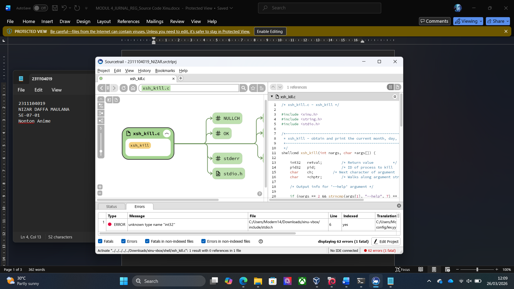
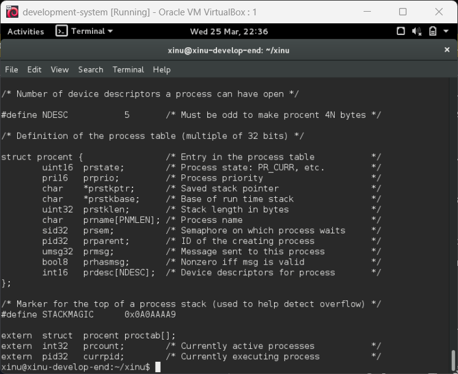
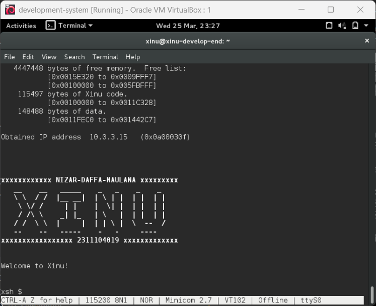

<h1 align="center">Laporan Praktikum Modul 4<br> Membaca Source Code Xinu</h1>

<p align="center">NIZAR DAFFA MAULANA - 2311104019</p>

## Dasar Teori

Xinu (akronim dari Xinu Is Not Unix) adalah OS kecil berorientasi pendidikan yang dikembangkan oleh Douglas Comer. Karakteristik Xinu, dirancang agar mudah dipahami strukturnya, sehingga sangat cocok untuk mempelajari internal sistem operasi, manajemen proses, dan memori. Format file yang digunakan seringkali berbentuk .ova (Open Virtualization Format Archive) yang siap diimpor ke dalam VirtualBox.

## Guided

Hasil praktikum modul 4:



## Unguided

1. [10 Poin] Apa nama image yang dihasilkan setelah melakukan kompilasi pada Xinu? Berapa ukuran file tersebut? Ada pada folder apa file image tersebut?

   Hint: baca kembali modul-modul sebelumnya

   Jawab:

   Nama image setalah kompilasi adalah **xinu.elf**. Ukuran file tersebut adalah **159180 byte**. File image tersebut ada pada folder **~/xinu/compile**.

2. Membaca source code Xinu

- a. Cek aplikasi bernama Sourcetrail di PC. Jika belum ada, download SourceTrail pada (DOWNLOAD SOURCETRAIL). SourceTrail adalah software untuk mengeksplorasi source code. Programmer yang bagus lebih banyak membaca kode daripada menulis kode
- b. Download file source code xinu yang tersedia pada attempt jurnal praktikum di LMS
- c. Jalankan SourceTrail
- d. Project  New Project
- e. Isi nama project xinu dan pilih lokasi project di manapun
- f. Add Source Groups, pilih C, lalu pilih Empty C Source Group
- g. File & Directories to Index: masukkan semua folder Xinu (yang sebelumnya telah di download)
- h. Include Paths: …/xinu/include
- i. Create
- j. Silahkan eksplorasi source code Xinu

Jawab:


3. [10 Poin] Carilah struktur data dari proses pada Xinu OS. Struktur data proses ada pada file apa? Informasi apa saja yang disimpan dalam struktur data tersebut?

Hint: file berektensi .h

Pada Linux bisa digunakan perintah “grep”

Contoh:

```sh
$ grep -r “kata_yang_ingin_dicari” /path/ke/direktori/tempat/file/berada
```

Jawab:

Struktur data proses ada pada file `process.h`. Struktur data proses pada Xinu menyimpan informasi sebagai berikut:



4. [80 poin] Mengubah welcome banner pada Xinu

- a. Carilah file yang menyimpan banner Xinu!
  Hint: file berekstensi .h pada direktori xinu/include

- b. Carilah file yang menampilkan banner Xinu!
  Hint: file berektensi .c pada direktori xinu/shell

- c. Ubahlah welcome banner Xinu sehingga menjadi seperti ini: [gambar]
  Tambahkan NAMA dan NIM masing-masing, kemudian ubah banner Xinu sesuai dengan selera Anda
- d. Setelah melakukan perubahan lakukan perintah berikut ini pada terminal Linux
  - $ cd xinu/compile
  - $ make clean
  - $ make
  - $ sudo minicom
  - Jalankan vm backend

Jawab:



## Referensi

1. https://en.wikipedia.org/wiki/Xinu
